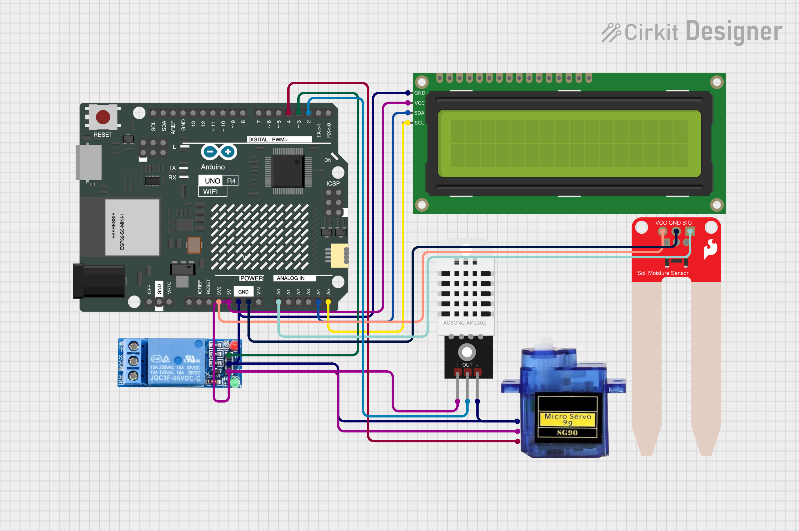
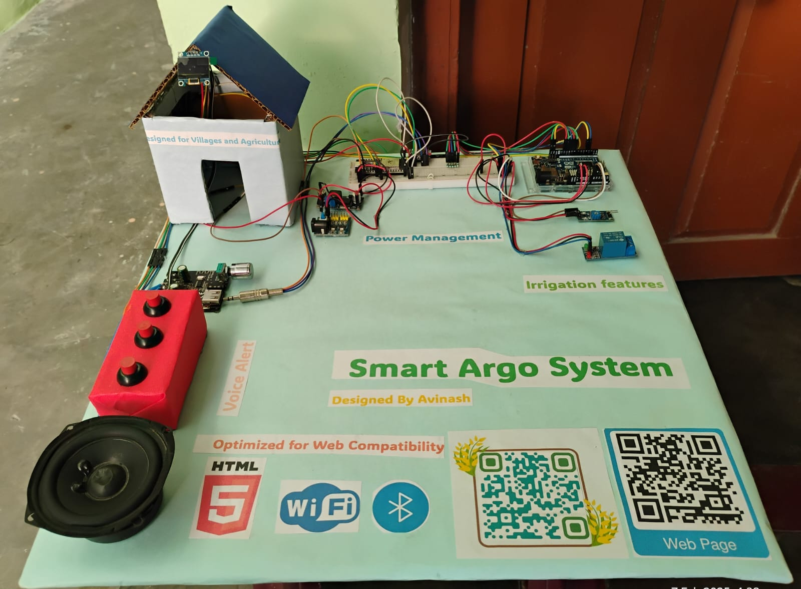

# 🌾 Smart Village Irrigation System

An intelligent, automated, and energy-efficient irrigation ecosystem designed to optimize water distribution, reduce manual farm labor, and aid sustainable agriculture in regions with limited water or nocturnal electrical availability.

---

## 📌 Project Background
Created by **Avinash**, this system provides an innovative approach to modern village farming by applying precision agriculture techniques. Instead of constant or blind scheduled watering, the system evaluates the real-time moisture needs of the soil directly, conserving valuable resources while maximizing crop yields.

---

## ⚙️ Core System Architecture
The hardware operates using an embedded microcontroller configuration that continuously pulls sensory inputs, prints immediate feedback locally, and runs an asynchronous local server to receive external manual instructions.

---

## 🛠️ Complete Hardware Inventory
* **Microcontroller:** Arduino R4 WiFi (Handles automated feedback loops and local network hosting)
* **Displays & Interfaces:** LCD 16x2 with an I2C module interface
* **Sensors:** * **Soil Moisture Sensor:** Analog probe tracking underground moisture metrics
  * **DHT22 Sensor:** High-precision atmospheric temperature and humidity sensor
* **Actuators & Switches:**
  * **5V Relay Module:** Isolates high-power lines from microchip operations
  * **Submersible DC Water Pump**
  * **Micro Servo Motor:** Mechanical sweeping arm action
* **Prototype Environment:** Dual breadboards, dynamic step-up/step-down power delivery regulations, and connection leads

---

## 🔌 Circuit Interconnections
Below is the system wiring configuration for your reference.



### Pin Configuration Summary:
* **Digital Pin 2:** Attached to the DHT22 Data Wire
* **Digital Pin 3:** Relayed output connection to the DC Water Pump
* **Digital Pin 4:** Connected directly to the Micro Servo signal wire
* **Analog Pin A0:** Dedicated input stream for reading the Soil Moisture Sensor
* **SDA & SCL Pins:** Dedicated I2C bus wiring shared with the LiquidCrystal display interface

---

## 💻 Tech Stack & Protocols
* **Firmware Runtime:** Embedded C++ utilizing native tracking drivers (`WiFi.h`, `DHT.h`, `Wire.h`, `LiquidCrystal_I2C.h`, and `Servo.h`)
* **Local Web Server:** Asynchronous network loop listening on Standard Port 80
* **Dashboard Frontend:** Modern HTML5, customized Poppins font engine styling, full system status responsive bars, and user dark mode customization scripts

---

## 🚀 Deployment Instructions

### 1. Configuration & Flashing
1. Open the project inside your **Arduino IDE**.
2. Make sure you have installed the **DHT Sensor Library**, **LiquidCrystal_I2C**, and **Servo** libraries via the Library Manager.
3. Change the network connection parameters within your sketch file to match your target router:
   ```cpp
   const char* ssid = "YOUR_WIFI_NAME";
   const char* password = "YOUR_WIFI_PASSWORD";
